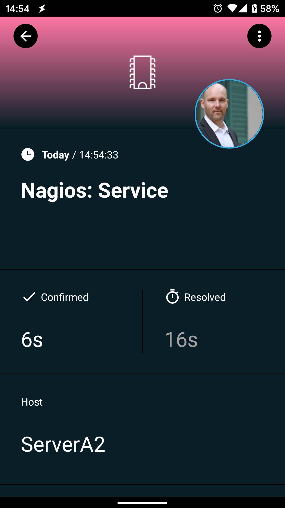

# SIGNL4 Plugin for Nagios

## Why SIGNL4

SIGNL4 is a mobile alert notification app for powerful alerting, alert management and mobile assignment of work items. Get the app at https://www.signl4.com.

Pairing Nagios with SIGNL4 can enhance your daily operations with an extension to your team wherever it is.



## Setup

In the following we describe the setup and configuration of the SIGNL4 Plugin for Nagios:

1. If not already done, sign up for your SIGNL4 account at https://www.signl4.com or directly from within your SIGNL4 app you can download from the Play Store or App Store.

2. Copy the two scripts ("signl4_host_notify.sh" and "signl4_service_notify.sh") to your Nagios plugin directory (the location may vary).

3. Edit the SIGNL4 URLs in these scripts to the match your SIGNL4 webhook URL including your team secret (replace "<team-secret>" with your own team secret).

4. Define the new notification commands in the Nagios configuration (a sample configuration is available in the file "signl4_commands.cfg"). Please, modify the paths accordingly.

5. Set up a new contact in Nagios or use an existing one to add notification commands for host and service. You can find an example below:

```
define contact{
        contact_name                    root
        alias                           Root
        service_notifications_enabled   1
        host_notifications_enabled      1
        service_notification_period     24x7
        host_notification_period        24x7
        service_notification_options    w,u,c,r
        host_notification_options       d,r
        service_notification_commands   signl4-service,notify-service-by-email
        host_notification_commands      signl4-host,notify-host-by-email
        email                           root@localhost
        }
```

6. Now you can test it by simulating an incident. When Nagios detects the issue, the information will be forwarded to your SIGNL4 team.
